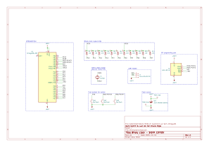

# BINARY CLOCK SIGMA EDITION AVR CODE - ATMEGA48

30 min peer programming!!!

Prüufung (Folie 1/2)
▶ Präsentation + Fachfragen (20min) Ihrer Lösung der Komplexaufgabe
Komplexaufgabe
▶ Binäre Ausgabe auf 11 LED’s mit hardware PWM Helligkeitssteuerung (OC1x-Pin)
▶ Steuerung über Taster (INT0,x, y)
▶ Sleepmode mit Beweis der reduzierten Leistungsaufnahme, Batterielaufzeit
▶ Zeitbasis über Timer und Uhrenquarz, mit Genauigkeitsmessung
▶ RS232 Debug-Interface (mindestens setzen und lesen der Zeit)

Fachfragen
▶ Im Rahmen der Prüfung werden wir Ihnen eine Schaltung (ähnlich der Ihrer Uhr)
vorgeben an der Sie live eine Aufgabe lösen werden.
▶ Als Hilfsmittel haben Sie hierfür Ihren Sourcecode sowie das Datenblatt des
ATmega.

=> uhrenquarz action
=> steuerung + sleepmode
=> debug interface
=> hwp labor action
