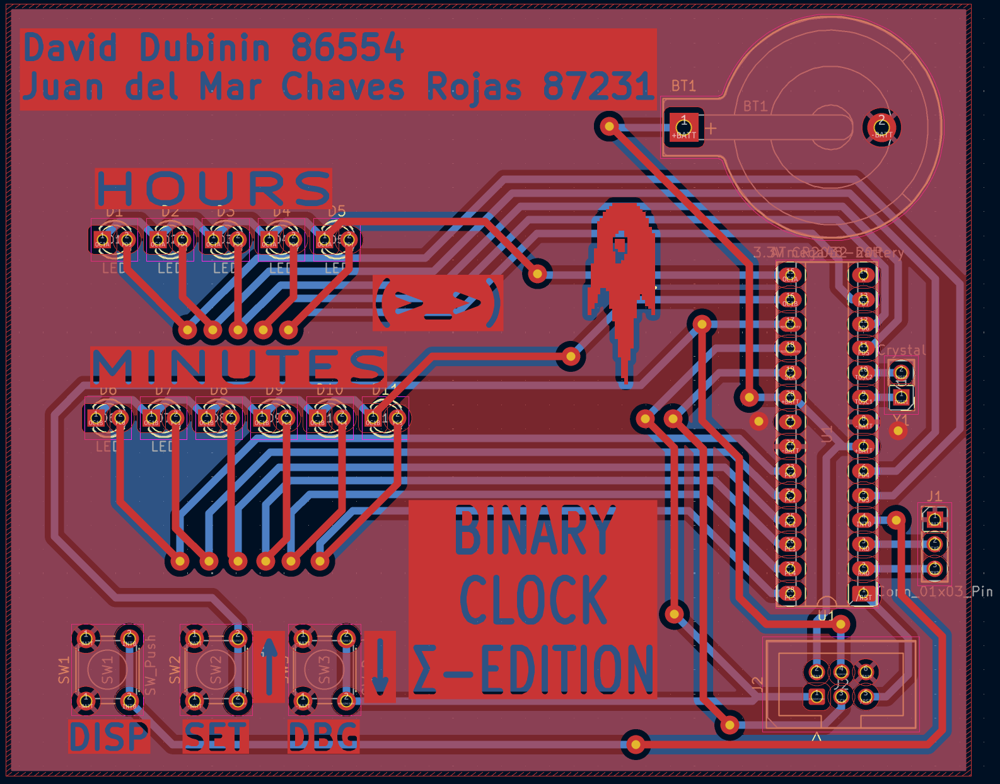
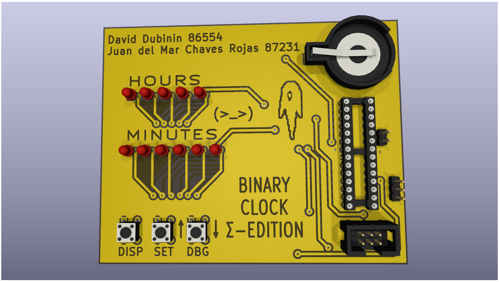

# BINARY CLOCK SIGMA EDITION AVR CODE - ATMEGA48

 
  
Prüufung (Folie 1/2)  
▶ Präsentation + Fachfragen (20min) Ihrer Lösung der Komplexaufgabe  
  
Komplexaufgabe  
▶ Binäre Ausgabe auf 11 LED’s mit hardware PWM Helligkeitssteuerung (OC1x-Pin)  
▶ Steuerung über Taster (INT0,x, y)  
▶ Sleepmode mit Beweis der reduzierten Leistungsaufnahme, Batterielaufzeit  
▶ Zeitbasis über Timer und Uhrenquarz, mit Genauigkeitsmessung  
▶ RS232 Debug-Interface (mindestens setzen und lesen der Zeit)  
  
Fachfragen  
▶ Im Rahmen der Prüfung werden wir Ihnen eine Schaltung (ähnlich der Ihrer Uhr)
vorgeben an der Sie live eine Aufgabe lösen werden.  
▶ Als Hilfsmittel haben Sie hierfür Ihren Sourcecode sowie das Datenblatt des
ATmega.  
  
  
=> save code size  
  
//selbst gemessen  
I_active= 937.00 μA 
I_powersave= 168.91 μA  
I_powersavesec = 6.96 μA  
U=3.5V  
  
Leistungsaufnahme
P_active = 937.00 μA * 3.5V = 3.2795mW  
P_powersave = 168.91 μA * 3.5V = 591.185μW
P_powersavesec = 6.96 μA  * 3.5V = 24.36μW
  
Bei Varta CR2032 mit Kapazität von 230 mAh:  
Lebensdauer in Stunden = (Kapazität in Ah/Strom in A)  
Lebensdauer = (0,230Ah/0,000937A) = 245,46 Stunden  
Lebensdauer = (0,230Ah/0,00016891A) = 1.361,67 Stunden  
d.h. 10,23 Tage (Ohne Sleepmode) und 56,74 Tage (Mit Sleepmode)  
  
Und mit !!1s!!-Zeitbasis in Sleepmode:  
Lebensdauer = (0,230Ah/0,00000696A) = 38.045,98 Stunden = 1.585,25 Tage = 4,34 Jahre  

Das Delta zwischen den Leistungsaufnahmen im sleepmode mit ms oder sek Zeitbasis lässt sich dadurch erklären, dass bei der Millisekunden variante der Mikrocontroller wegen der hohen frequenz an Timer2 compare-match interrupts viel öfter aufwacht, um diese abzuarbeiten.
  
T=1.9998721s (an aus zyklus)  
T/2 = 0.99993605 
  
=> ((1s-0.99993605s)\*1000\*1000)/1s \≈ 64μs/1s = +64ppm  
Die Uhr geht also etwas zu schnell. Hochgerechnet führt das zu einem wöchentlichen Drift von 64μs/1000/1000*(60\*60\*24\*7)= +38.7072s
Das könnte man durch trial & error in der Software kompensieren, ähnlich wie bereits getan, um die Millisekunden-Zeitbasis zu implementieren.
  
